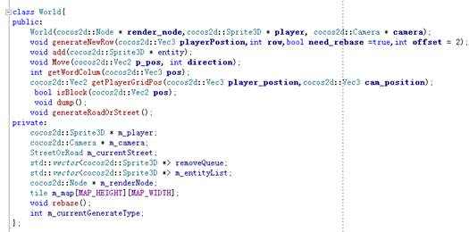
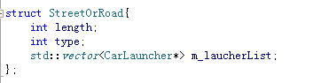
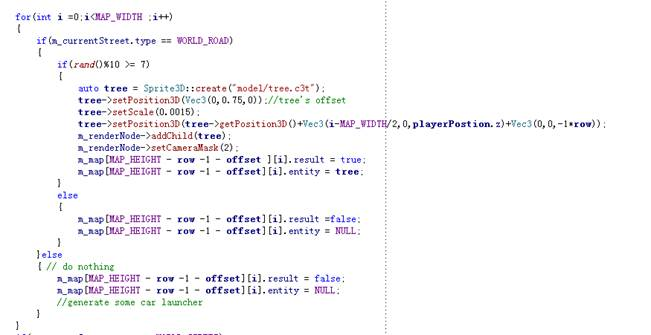

<html>

<head>
<meta http-equiv=Content-Type content="text/html; charset=gb2312">
<meta name=Generator content="Microsoft Word 14 (filtered)">

</head>

<body lang=ZH-CN style='text-justify-trim:punctuation'>
过马路教程2
--------

这篇教程承接上篇，这个模块主要是考虑如何生成一个自定义的缓冲地带，和马路：为了统筹这些概念，我创建了一个叫World的类：

我们来看看如何生成马路和缓冲地带，首先，缓冲地带和马路一定是交替的，其次他们之间的长度可以是随机的（在一定范围内），为此，我们创建了一个结构体，用来表征当前的缓冲地带(road)，还是街道(street)。

我们在generateNewRow里，生成道路：首先判断当前应该生成的是街道，还是缓冲带，如果宽度小于等于零则交替替换：

如果是缓冲带阶段，我们随机生成一些树：

现在我们这里已经能随机显示一些树木了，我们现在要考虑下一个问题，就是如何探测有树的地方，不允许角色移动过去，最为直白的的方式可能就是将所有的物体循环一遍，取出该物体的AABB与角色的AABB，检查看是否有碰撞，但是这个方式太慢了,我们这里能显示的区域至少有十来条可能潜在有障碍物的缓冲带，同时每条缓冲带上，我们还有十来个实体。

&nbsp;&nbsp;&nbsp; 我们玩原版的游戏就会发现，障碍物是等大的，因此在这里我们可以构建一幅棋盘，用户在一副“棋盘”里行走，然后更具角色所在的棋盘的格子的坐标来进行判断，很显然，这个棋盘我们可以使用一个二维数组来实现，众所周知，对于数组这一数据结构的随机访问的时间复杂度是O(1)，所以我们可以快速的判断某些格子是否有障碍物，并进行快速判断，所以我们能够在非常迅速的进行碰撞检测。

&nbsp;&nbsp;&nbsp; 然后我们封装成一个World的函数，来进行判断就可以了：

</body>

</html>
