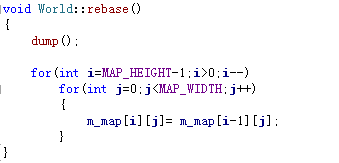
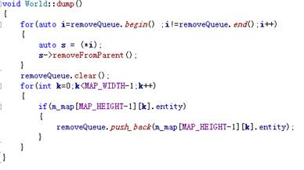
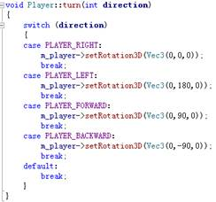
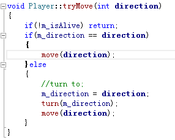
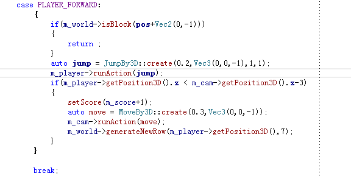

<html>

<head>
<meta http-equiv=Content-Type content="text/html; charset=gb2312">
<meta name=Generator content="Microsoft Word 14 (filtered)">

</head>

<body lang=ZH-CN style='text-justify-trim:punctuation'>
过马路教程3
--------

紧接上一篇，上一篇在World这个类中，我们构建好了一个棋盘，让用户在这里移动。但是我们并没有考虑到这个棋盘是动态的——因为用户不断地在向前方走，所以我们的“棋盘”要不断的更新它，怎么更新它能，这里我们要用一个新函数rebase，来简单的移除它。

&nbsp;&nbsp;&nbsp; 

这个移除的方式非常的简单，用上一行的数据把下一行的数据进行覆盖，这样相当于不断地在更新，再配合之前说过的Wordl的generateNewRow函数，我们可以把最开始的那一行给覆盖掉，但是我们消失掉的那些模型并未被回收掉，因此我们在执行rebase之前，先调用一个dump函数，将末尾一行的所有可能有的Sprite3D给回收掉。

我们来看看是如何实现的：

我在这实现了一个删除队列，每一次将存在的模型的压入这个队列中，并在下一次调用的时候，删除现有队列的所有的元素，这样，就不会出现经过后的模型并未回收的问题了，在配合上前两篇教程的基础上，我们将角色的行动部分给补全，首先是如果朝向不一样的话，要改变朝向：

&nbsp;&nbsp;&nbsp; 我们tryMove就变成了这样：

然后在move函数里，添加检测前一篇说的检查碰撞部分，然后在综合碰撞以及镜头跟随，就可以直接移动了，比方说以向上移动为例子：

&nbsp;&nbsp;&nbsp; 

这样，整个，生成道路，障碍物，角色行走部分都说完了，下一篇我们将讨论如何加入形式的汽车。

&nbsp;

</body>

</html>
