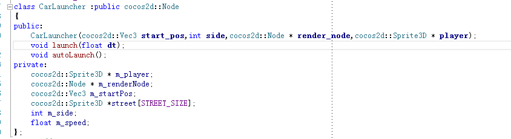
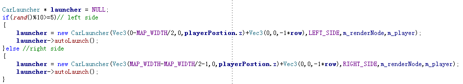
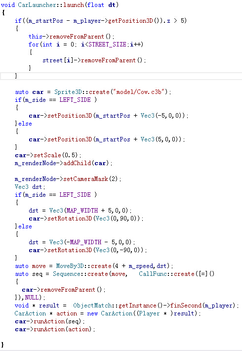
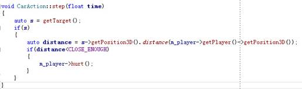
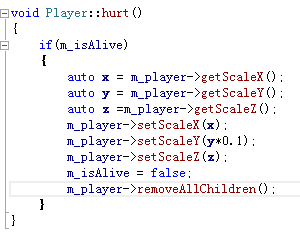
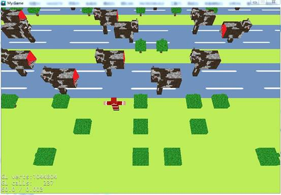

<html>

<head>
<meta http-equiv=Content-Type content="text/html; charset=gb2312">
<meta name=Generator content="Microsoft Word 14 (filtered)">

</head>

<body lang=ZH-CN style='text-justify-trim:punctuation'>
过马路教程4
-------

这篇教程，我们描述管理车辆运动的模块CarLauncher，引入这个概念的原因是，从全局的角度的考虑哪一辆车辆开被创建出发，哪一个车辆遇角色想碰，哪一个车辆该被销毁是比较复杂的，所以我们引入一个“车辆发射器”的概念，如下：

&nbsp; 这个CarLauncher本身就是一个Node，这样做的好处是可以享受到Node的schedule计时器，同时，其下辖的子节点，比方说车辆等等，能在其销毁时一并销毁。

他在World创建一行新路时，如果遇到是街道时触发调用：

&nbsp; 这里使用rand函数生成一个伪随机数，来确定车辆是左行还是右行的，为了让每次进入游戏都不一样，请注意在程序开始的时候调用srand传一个参数——比方说当前时间，作为随机生成种子。

Launcher自身会调用一个schedule，用其生成车辆：

&nbsp; 这里自定义了一个Sequence，里面包含了一些lambda表达式的内容，将car指针抓成闭包，用于在车辆移移动至街道的另一头的时候把自己删除。有兴趣的朋友可以通过一些更复杂的方式，提高游戏难度，比如根据用户当前的分数，加快创建车辆的频率以及车辆行驶的速度，这些内容都不算太难，在这里不展开介绍。

&nbsp;

&nbsp; 接下来是让车辆与角色进行碰撞，在这里，因为我采用的模型大小是一致的，所以我简单的在CarAction里进行了一个距离碰撞(包围球)，如果大家在改写这个demo时，使用了更复杂的模型，可以考虑使用AABB或者OBB进行碰撞检测。

&nbsp;&nbsp;&nbsp;&nbsp;&nbsp;&nbsp;&nbsp;&nbsp; 

在角色的hurt方法里，我们将其“压扁”然后禁止其继续移动：

注意我们这个角色的模型是已经进行缩放过了的，所以要再次进行缩放，请务必乘上之前的系数。这样，我们的游戏就能够正常的跑起来了~~~！

&nbsp;

</body>

</html>
